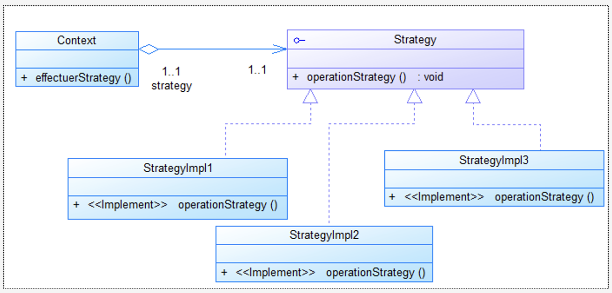
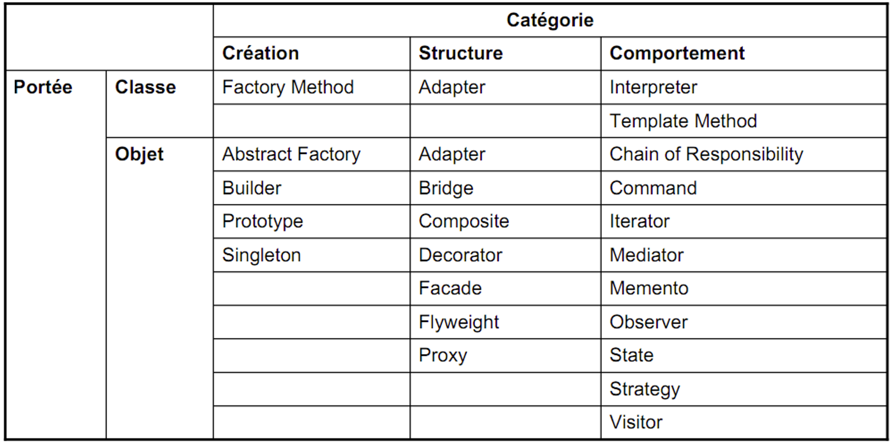

<h3>Pattern Strategy</h3>
<ul>
 <li><strong>Catégorie :</strong> Comportement</li>
 <li><strong>Définition : </strong> 
Définir une famille d’algorithmes, et encapsuler chacun et les rendre interchangeables tout en assurant que chaque algorithme puisse évoluer indépendamment des clients qui l’utilisent
 </li>
<li><strong>Raisons d'utilisation :</strong> Un objet doit pouvoir faire varier une partie de son algorithme dynamiquement.</li>
<li><strong>Diagramme de classes :</strong> </li>
<li>
  Lien des vidéos : 
   <ul>
    <li>Part 1 : https://www.youtube.com/watch?v=VV0AKv4JoHo</li>
    <li>Part 2 : https://www.youtube.com/watch?v=z_Q20_gWqXw</li>
   </ul>

</li>
<li>
  <strong>Classification GOF des design patterns :</strong>
  
</li>
</ul>